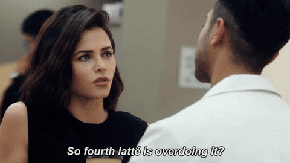

# My First Coding Assignment #
()

## About Me ##

 Hello, my name is Olivia Blackstock. I am born and raised in New Orleans, Louisiana. I am the youngest of three, with my older siblings being 13 and 11 years older than me. This meant I had two sets of parents since they were much older. I have a dachshund terrier mix named Winnie that is almost 8 years old. She is my work from home and study buddy. I currently am a Public Relations Director for a small consulting agency where we work on a lot of web projects. 

## Past Coding Experience ##

 I don't have much coding experience. I have worked with minimal HTML and CSS in content management systems such as WordPress and other website builders. I am familiar with basic styling HTML but that is about it. 
 

 ## Career Goals ##
1. Create a robust public relations campaign to present APR. 
2. Obtain my accrediation as a public relations practitioners. 
3. Mentor and teach newer professionals. 
4. Become an in-house public relations or marketing director. 
5. Work for a beauty company doing communications either in-house or as a client. 